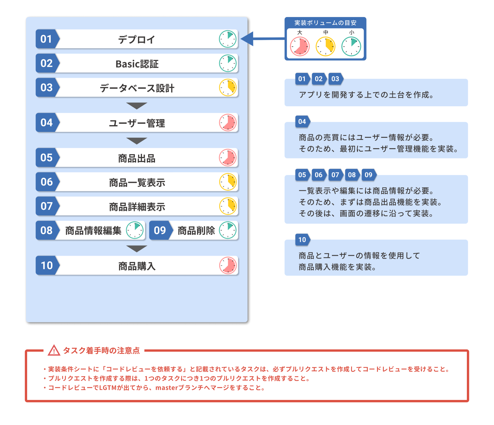
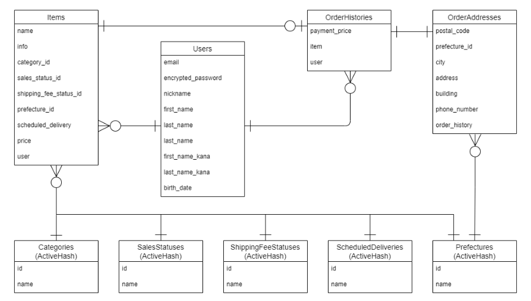

# README

# データベース設計
## Items

| Column | Type | Options |
|------|----|-------|
| name | string | null: false |
| info | text | null: false |
| category_id | integer | null: false |
| sales_status_id | integer | null: false |
| shipping_fee_status_id | integer | null: false |
| prefecture_id | integer | null: false |
| scheduled_delivery_id | integer | null: false |
| price | integer | null: false |
| user | references | null: false, foreign_key: true |

※imageはActiveStorageで実装するため含まない

### Association
extend ActiveHash::Associations::ActiveRecordExtensions  
belongs_to :category  
belongs_to :sales_status  
belongs_to :shipping_fee_status  
belongs_to :prefecture  
belongs_to :scheduled_delivery  
belongs_to :user  
has_one :order_history  

## Users

|Column|Type|Options|
|------|----|-------|
| email | string | null: false, unique: true |
| encrypted_password | string | null: false |
| nickname | string | null: false |
| first_name | string | null: false |
| last_name | string | null: false |
| first_name_kana | string | null: false |
| last_name_kana | string | null: false |
| birth_date | date | null: false |

### Association
has_many :items  
has_many :order_histories  

## OrderHistories

|Column|Type|Options|
|------|----|-------|
| payment_price | integer | null: false |
| item | references | null: false, foreign_key: true |
| user | references | null: false, foreign_key: true |

### Association
belongs_to :item  
belongs_to :user  
has_one :order_address  

## OrderAddresses

|Column|Type|Options|
|------|----|-------|
| postal_code | string | null: false |
| prefecture_id | integer | null: false |
| city | string | null: false |
| address | string | null: false |
| building | string |  |
| phone_number | string | null: false |
| order_history | references | null: false, foreign_key: true |

### Association
extend ActiveHash::Associations::ActiveRecordExtensions  
belongs_to :prefecture  
belongs_to :order_history  

# ER図

# ActiveHash
## Categories
|Column|Type|
|------|----|
| id | integer |
| name | string |

### Association
include ActiveHash::Associations  
has_many :items

## SalesStatuses
|Column|Type|
|------|----|
| id | integer |
| name | string |

### Association
include ActiveHash::Associations  
has_many :items  

## ShippingFeeStatuses
|Column|Type|
|------|----|
| id | integer |
| name | string |

### Association
include ActiveHash::Associations  
has_many :items  

## ScheduledDeliveries
|Column|Type|
|------|----|
| id | integer |
| name | string |

### Association
include ActiveHash::Associations  
has_many :items  

## Prefectures
|Column|Type|
|------|----|
| id | integer |
| name | string |

### Association
include ActiveHash::Associations  
has_many :items  
has_many :order_addresses
